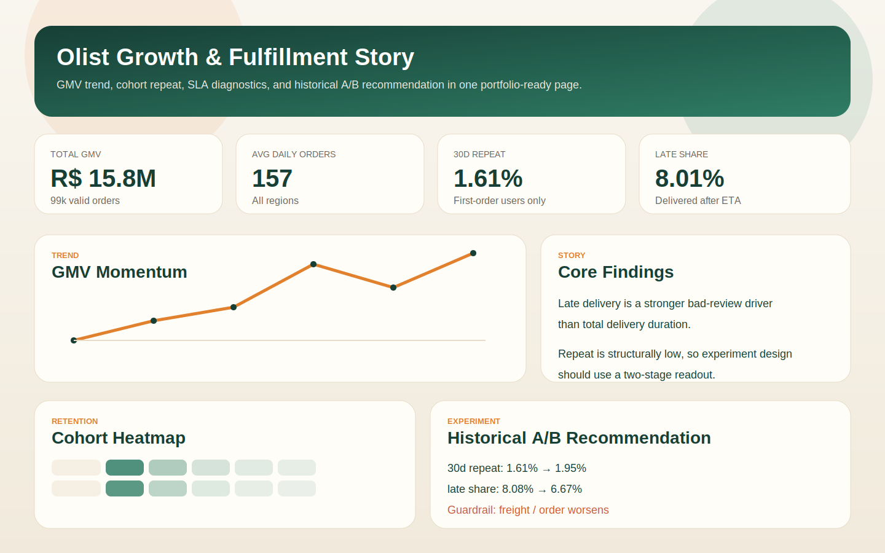
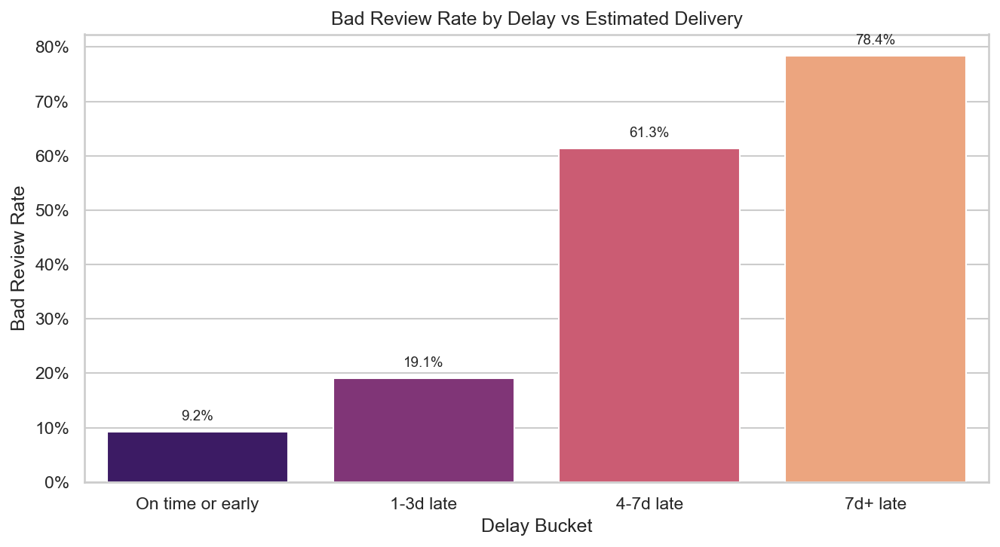
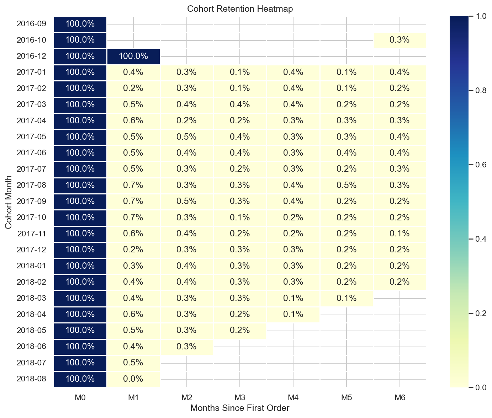

# Olist Growth Lab

一个围绕 Olist 电商数据完成的增长分析项目：从指标口径、漏斗、物流体验与差评分析、cohort 复购、复购驱动因素，到实验设计、历史 A/B 演练和 dashboard 展示，形成了一条完整的“洞察 -> 方案 -> 决策建议”链路。



## 项目亮点

- 定义统一指标口径：`valid order`、`GMV`、`active buyers`、`AOV`
- 验证物流履约体验与差评、复购之间的关系
- 构建首单 cohort 与复购分析，识别低频场景约束
- 设计 `First-order SLA Upgrade` 实验并做历史 A/B 模拟
- 搭建 Streamlit dashboard，便于作品集和面试演示

## Dashboard

最终展示选择了 `Streamlit`，入口文件是 [app.py](app.py)。

页面包含 4 个主要模块：

- `GMV trend`：按月展示 GMV 与订单规模变化
- `Cohort heatmap`：展示首单 cohort 在后续月份的复购表现
- `SLA vs bad review / repeat`：展示延迟 bucket 与体验/复购的关系
- `Historical A/B simulation`：展示履约实验的模拟结果与 rollout recommendation

## 核心发现

### 1. 履约晚到比总时长更能解释差评

- `On-time / Early` 差评率约 `9.23%`
- `1-3d late` 差评率约 `19.12%`
- `4-7d late` 差评率约 `61.31%`
- `7d+ late` 差评率约 `78.42%`

这说明“是否晚于承诺时间”是更关键的体验拐点。



### 2. Olist 是明显低频复购场景

- `30d repeat` 约 `1.62%`
- `60d repeat` 约 `1.98%`

因此实验不适合只盯长期指标，而更适合“两阶段”读数：先看机制指标，再看复购。



### 3. 历史 A/B 模拟支持“继续跑，但别直接全量”

默认 uplift 场景下：

- `30d repeat`：`1.61% -> 1.95%`
- `late share`：`8.08% -> 6.67%`
- `bad review share`：`14.38% -> 13.48%`
- `freight / order`：`22.50 -> 23.53`

主指标和体验指标方向都对，但成本护栏恶化，因此更合理的结论是：

`继续跑 / 小范围放量，不直接全量上线。`

## 仓库结构

```text
.
├── app.py
├── data/raw/olist.sqlite
├── notebooks/
│   ├── 02_funnel.ipynb
│   ├── 03_cohort_retention.ipynb
│   ├── 04_repeat_purchase_model.ipynb
│   ├── 05_ab_test_design.ipynb
│   └── 06_ab_simulation.ipynb
├── reports/
│   ├── ab_plan.md
│   ├── ab_results.md
│   ├── insights.md
│   ├── metric_definitions.md
│   ├── one_pager.md
│   ├── project_report.md
│   └── figures/
├── requirements.txt
└── sql/
```

## 关键文件

- 指标口径：[reports/metric_definitions.md](reports/metric_definitions.md)
- 项目报告：[reports/project_report.md](reports/project_report.md)
- 实验方案：[reports/ab_plan.md](reports/ab_plan.md)
- 实验结果：[reports/ab_results.md](reports/ab_results.md)
- 一页总结：[reports/one_pager.md](reports/one_pager.md)

## 运行方式

### 1. 准备数据

数据来源：Kaggle 数据集 `terencicp/e-commerce-dataset-by-olist-as-an-sqlite-database`。

```bash
kaggle datasets download terencicp/e-commerce-dataset-by-olist-as-an-sqlite-database -p data/raw/_tmp --unzip
```

数据库文件应位于：

```bash
data/raw/olist.sqlite
```

### 2. 安装依赖

```bash
python3 -m venv .venv
source .venv/bin/activate
pip install -r requirements.txt
```

### 3. 启动 dashboard

```bash
streamlit run app.py
```

## 指标口径

- `Valid order`：`order_status NOT IN ('canceled', 'unavailable')` 且 `paid_value > 0`
- `GMV`：有效订单上的 `SUM(payment_value)`
- `30d repeat`：首单后 30 天内再次产生新的有效订单
- `Late share`：`order_delivered_customer_date > order_estimated_delivery_date`
- `Bad review`：`review_score <= 2`


## 结论

这份项目最值得展示的地方，不只是“做了分析”，而是把增长分析常见的几个环节串了起来：

- 先定义可靠指标
- 再做行为与体验洞察
- 然后设计实验
- 最后给出可执行的上线建议和作品集级展示页
