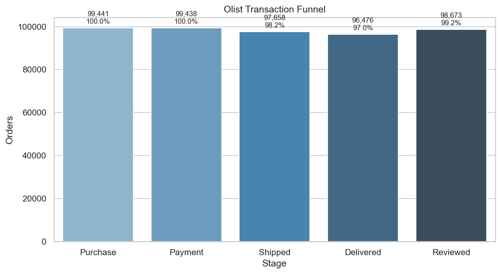
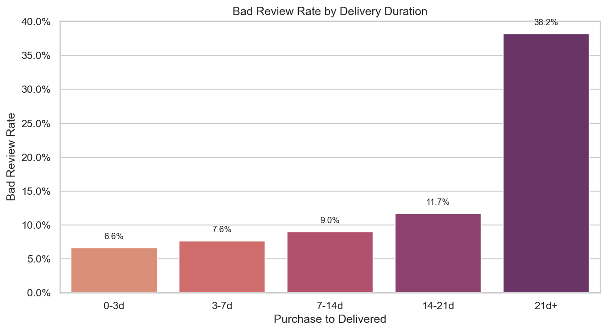

# Olist Growth Lab - Analysis Report

## 项目目标

本项目围绕 Olist 电商数据，完成三块增长分析：

- Day 1：建立订单事实表与基础指标口径
- Day 2：分析交易漏斗，并验证“物流时效影响差评”的假设
- Day 3：建立用户首单 cohort，分析次月和 3 个月复购

报告核心问题是：

- 交易链路的主要流失在哪里
- 用户体验，尤其是物流体验，是否会伤害评价与复购
- 哪些 cohort 的后续复购更好或更差

## 数据与口径

- 数据源：Olist SQLite 数据库
- 用户口径：`customer_unique_id`
- 时间口径：`order_purchase_timestamp`
- 有效订单口径：`order_status NOT IN ('canceled', 'unavailable')` 且 `paid_value > 0`

相关实现文件：

- [sql/metrics_v0.sql](../sql/metrics_v0.sql)
- [sql/funnel_analysis.sql](../sql/funnel_analysis.sql)
- [sql/cohort.sql](../sql/cohort.sql)

## 一、交易漏斗结果

整体漏斗：

- 下单：99,441
- 支付：99,438
- 发货：97,658
- 签收：96,476

关键转化率：

- 下单到支付：约 `100.0%`
- 支付到发货：`98.21%`
- 发货到签收：`98.79%`

解读：

- 交易前半段整体非常顺畅，支付并不是主要瓶颈。
- 订单在履约阶段仍有一定损耗，但更值得关注的是履约体验带来的满意度与复购问题。

## 二、物流时效与差评

### 按总履约时长看差评率

已签收且已评价订单按 `purchase_to_delivered_days` 分桶：

- `0-3d`：差评率 `6.63%`
- `3-7d`：差评率 `7.63%`
- `7-14d`：差评率 `8.96%`
- `14-21d`：差评率 `11.68%`
- `21d+`：差评率 `38.21%`

结论：

- 履约越慢，满意度越差。
- 当总时长超过 21 天后，差评率大幅跳升，说明用户体验存在明显阈值。

### 按是否晚于承诺时间看差评率

已签收且已评价订单按 `delivery_delay_vs_estimate_days` 分桶：

- `On time or early`：差评率 `9.23%`
- `1-3d late`：差评率 `19.12%`
- `4-7d late`：差评率 `61.31%`
- `7d+ late`：差评率 `78.42%`

结论：

- 相比总时长，是否晚于平台承诺时间对用户评分的解释力更强。
- 一旦晚到超过 4 天，差评率进入非常高的区间，说明平台承诺失约会显著破坏用户信任。

## 三、Cohort 复购结果

以用户首单月份定义 cohort，统计后续月份是否再次下单。

成熟 cohort 的平均表现：

- 平均 M1 复购率：`0.49%`
- 平均 M3 复购率：`0.25%`

说明：

- Olist 的用户复购整体偏低，平台更像低频电商场景。
- 因此，任何能改善首单体验并提升后续复购的动作，都值得优先尝试。

### 表现较好的 cohort

- `2017-10` cohort：M1 复购率 `0.71%`
- `2017-05` cohort：M3 复购率 `0.40%`
- `2017-03` 与 `2017-06` cohort：M3 复购率均约 `0.39%`

### 表现较弱的 cohort

- `2017-12` cohort：M1 复购率 `0.22%`
- `2017-02` cohort：M1 复购率 `0.24%`
- `2018-06` cohort：M3 复购率 `0.00%`
- `2017-10` cohort：M3 复购率 `0.09%`

解读：

- 最弱 cohort 往往出现在促销、季节切换或观察窗口较短的阶段，需要结合投放渠道和大促日历进一步判断。
- 即使最好的 cohort，M1 和 M3 复购率也不高，说明平台长期价值更依赖履约体验和用户信任，而不是单次转化拉新。

## 四、差评与后续复购

以“用户首个已评价订单”为起点，看后续是否产生新的有效订单：

- 首次评价为差评：后续复购率 `2.55%`
- 首次评价为非差评：后续复购率 `2.82%`

结论：

- 差评用户后续复购更低，方向上支持“负向体验伤害留存”的判断。
- 虽然绝对差值有限，但对低频平台来说，这种差异已经具备业务意义。

## 五、业务建议

基于这轮分析，建议优先做三类动作：

1. 治理高风险晚到订单。
   重点关注 `4 天以上晚到` 与 `21 天以上履约时长` 订单，因为这两类订单的差评风险最高。

2. 建立体验修复机制。
   对预计晚到或已差评用户，增加主动客服、补偿券、异常物流说明等动作，减少首次体验带来的长期流失。

3. 做 cohort 级复盘。
   将表现较差的 cohort 与对应月份的促销活动、渠道结构、履约波动做联动分析，定位问题到底来自获客质量还是履约体验。

## 六、局限性

- 数据库中的评价与签收字段并不完全同步，因此“评价率”不宜作为严格漏斗转化指标。
- cohort 结果采用“是否再次下单”的复购定义，更偏增长分析视角，不等同于精细化 CRM 留存口径。
- [notebooks/02_funnel.ipynb](../notebooks/02_funnel.ipynb) 与 [notebooks/03_cohort_retention.ipynb](../notebooks/03_cohort_retention.ipynb) 已在当前数据上执行成功；本报告中的图表来自同一套 SQL 口径。
